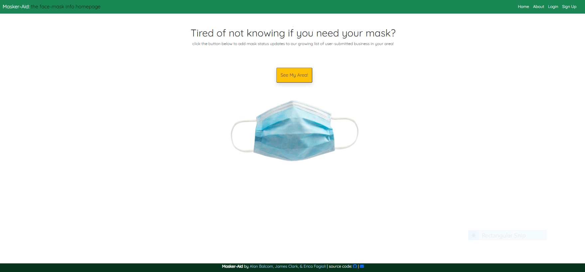

# Masker-aid - The Face Mask Info App
## Description

The Face Mask Info app is an application that allows the user to add mask status updates to businesses in their area. When a user visits our app they are prompted to login or sign up if they do not have an account. Once the user is logged in, they can search for a business which pulls from the Google Maps API. The business name and address populates, and the user has the option to view the business on google maps. The user is given three choices - requires mask, does not require mask, or requires proof of vaccination to enter and save to our database. 

 

## Table of Contents

- [Installation](#installation)
- [Screenshot](#screenshot)
- [GitHub](#Github)
- [Credits](#credits)
- [License](#license)

 

## Installation
- Clone the respositry from Github to your local machine 
- Open up your preferred terminal and navigate to the directory where you cloned the github repository
- Run in the terminal:
- npm install
- then --> Open MYSQL workbench and exeute the schema
- Run node seeds/index.js on the root
- Run node server.js on the root

 

## Dependancies to Install
- bcrypt
- connect-session-sequelize
- dotenv
- express
- express-handlebars
- express-session
- handlebars
- mysql2
- sequelize

 

## Usage

Open a browse abd search for localhost:3001

 

## Screenshot
 
 
 
 

## Github Repository
[Github](https://github.com/abalcs/Masker-Aid)

 

## Credits

Collaborators - James Clark [Github](https://github.com/jamespclark95) Alan Balcom [Github](https://github.com/abalcs) Erica Fagioli [Github](https://github.com/efagioli01)

UNH Full Stack Coding Book Camp partnered with Trilogy Education Services

Course Instructor - Benjamin Hutchins

Course TA - Andrew Hatfield

 

## MIT License

Copyright (c) [2021] [Alan Balcom]  [Erica Fagioli] [James Clark] 

Permission is hereby granted, free of charge, to any person obtaining a copy
of this software and associated documentation files (the "Software"), to deal
in the Software without restriction, including without limitation the rights
to use, copy, modify, merge, publish, distribute, sublicense, and/or sell
copies of the Software, and to permit persons to whom the Software is
furnished to do so, subject to the following conditions:

The above copyright notice and this permission notice shall be included in all
copies or substantial portions of the Software.

THE SOFTWARE IS PROVIDED "AS IS", WITHOUT WARRANTY OF ANY KIND, EXPRESS OR
IMPLIED, INCLUDING BUT NOT LIMITED TO THE WARRANTIES OF MERCHANTABILITY,
FITNESS FOR A PARTICULAR PURPOSE AND NONINFRINGEMENT. IN NO EVENT SHALL THE
AUTHORS OR COPYRIGHT HOLDERS BE LIABLE FOR ANY CLAIM, DAMAGES OR OTHER
LIABILITY, WHETHER IN AN ACTION OF CONTRACT, TORT OR OTHERWISE, ARISING FROM,
OUT OF OR IN CONNECTION WITH THE SOFTWARE OR THE USE OR OTHER DEALINGS IN THE
SOFTWARE.